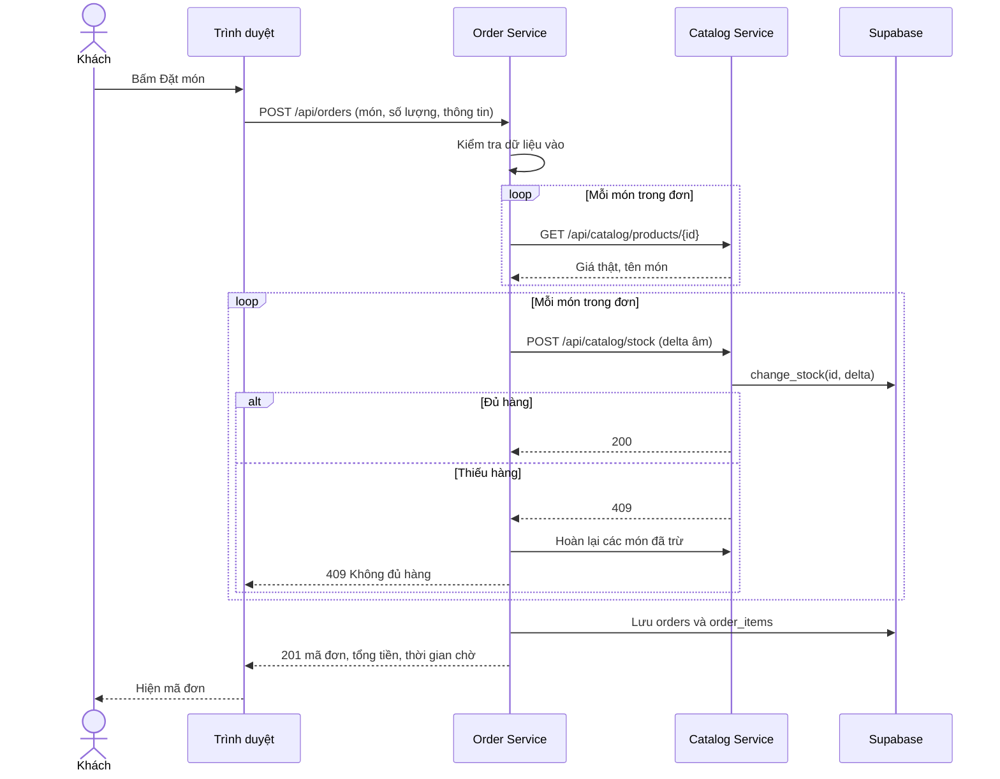

# Sơ đồ tuần tự: khách đặt món

Dán đoạn Mermaid bên dưới vào https://mermaid.live để xem và xuất ảnh PNG (lưu docs/ba/so-do-tuan-tu.png).

```mermaid
sequenceDiagram
    actor Khach as Khách
    participant Web as Trình duyệt
    participant Order as Order Service
    participant Catalog as Catalog Service
    participant DB as Supabase

    Khach->>Web: Bấm Đặt món
    Web->>Order: POST /api/orders (món, số lượng, thông tin)
    Order->>Order: Kiểm tra dữ liệu vào
    loop Mỗi món trong đơn
        Order->>Catalog: GET /api/catalog/products/{id}
        Catalog-->>Order: Giá thật, tên món
    end
    loop Mỗi món trong đơn
        Order->>Catalog: POST /api/catalog/stock (delta âm)
        Catalog->>DB: change_stock(id, delta)
        alt Đủ hàng
            Catalog-->>Order: 200
        else Thiếu hàng
            Catalog-->>Order: 409
            Order->>Catalog: Hoàn lại các món đã trừ
            Order-->>Web: 409 Không đủ hàng
        end
    end
    Order->>DB: Lưu orders và order_items
    Order-->>Web: 201 mã đơn, tổng tiền, thời gian chờ
    Web-->>Khach: Hiện mã đơn
```
